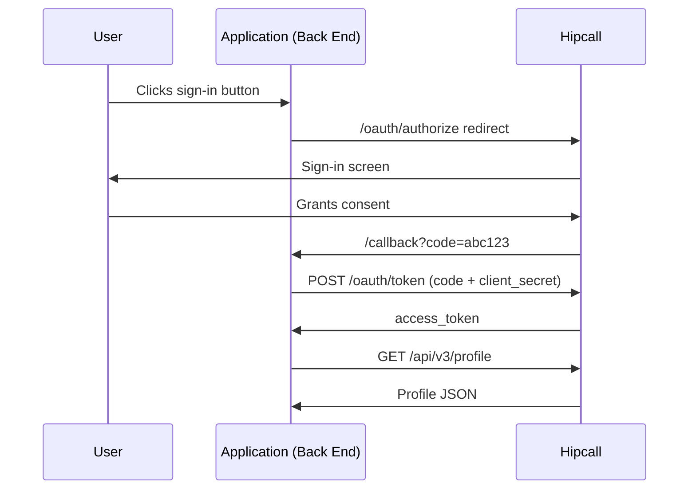

## Overview

The OAuth2 Authorization Code flow lets your web application access Hipcall user data with their consent. The user signs in on Hipcall, your application receives an authorization code, and your back end exchanges that code for an access token.

This page covers creating an OAuth2 application in the Hipcall dashboard, performing the token exchange with ASP.NET Core Minimal API, and fetching profile data with the resulting token.



## Before you start

You need:

- .NET 8 SDK or later (`dotnet --version` to check).
- A publicly reachable HTTPS address. For local development, use ngrok:
  ```bash
  ngrok http 5062
  ```

### Obtain your credentials

OAuth2 applications cannot be created directly from the user dashboard. You must provide your application details to the Hipcall support team to obtain your credentials.

Provide the support team with the following:
- **Redirect URI:** Your ngrok address. Example: `https://your-tunnel.ngrok-free.dev/callback`.
- **Application Type:** Web Application.

Once your request is approved, you will receive a **Client ID** and a **Client Secret**.

Set the environment variables:

```bash
export HIPCALL_CLIENT_ID="..."
export HIPCALL_CLIENT_SECRET="..."
export HIPCALL_REDIRECT_URI="https://your-tunnel.ngrok-free.dev/callback"
```

## Your first request

### Step 1: Build the authorisation URL

Redirect the user to Hipcall's sign-in screen with this URL structure:

```
https://use.hipcall.com/oauth/authorize?response_type=code
  &client_id=$HIPCALL_CLIENT_ID
  &redirect_uri=$HIPCALL_REDIRECT_URI
  &scope=profile+email+offline_access
  &state=a_random_value
```

| Parameter | Description |
|---|---|
| `response_type` | Always `code`. |
| `client_id` | The Client ID from the dashboard. |
| `redirect_uri` | Must match the Redirect URI registered in the dashboard exactly. |
| `scope` | Requested permissions. See the list below. Separate multiple scopes with `+`. |
| `state` | CSRF protection. Generate a unique random value per request and verify it on callback. |

### Scopes

The `scope` parameter determines what user data your application can access. Separate multiple permissions with a `+` sign (e.g., `profile+email+offline_access`).

You can request the following basic scopes:
- `profile`: Permission to read basic profile details such as name, surname, and ID.
- `email`: Permission to read the user's email address.
- `offline_access`: Permission to obtain a `refresh_token`, allowing you to renew access even when the user is offline.

### Step 2: Exchange the code for a token

After the user grants consent, Hipcall redirects the browser to your `redirect_uri` with a `?code=...` parameter. Send a POST request to `/oauth/token` to exchange the code for an access token:

```bash
curl -X POST https://use.hipcall.com/oauth/token \
  -d "client_id=$HIPCALL_CLIENT_ID" \
  -d "client_secret=$HIPCALL_CLIENT_SECRET" \
  -d "redirect_uri=$HIPCALL_REDIRECT_URI" \
  -d "grant_type=authorization_code" \
  -d "code=AUTHORIZATION_CODE"
```

### Step 3: Fetch profile data

Use the access token to call the API:

```bash
curl -H "Authorization: Bearer $ACCESS_TOKEN" \
  https://use.hipcall.com/api/v3/profile
```

## The full script

The following ASP.NET Core Minimal API application handles the callback, exchanges the code for a token, and fetches profile data:

```csharp
using System.Text.Json;

var builder = WebApplication.CreateBuilder(args);
builder.Services.AddHttpClient();
var app = builder.Build();

var clientId = Environment.GetEnvironmentVariable("HIPCALL_CLIENT_ID")
    ?? throw new InvalidOperationException("HIPCALL_CLIENT_ID is not set.");
var clientSecret = Environment.GetEnvironmentVariable("HIPCALL_CLIENT_SECRET")
    ?? throw new InvalidOperationException("HIPCALL_CLIENT_SECRET is not set.");
var redirectUri = Environment.GetEnvironmentVariable("HIPCALL_REDIRECT_URI")
    ?? throw new InvalidOperationException("HIPCALL_REDIRECT_URI is not set.");

app.MapGet("/callback", async (string? code, string? error,
    IHttpClientFactory httpClientFactory) =>
{
    if (!string.IsNullOrEmpty(error))
        return Results.Content($"OAuth error: {error}", "text/plain");

    if (string.IsNullOrEmpty(code))
        return Results.Content("Authorization code not found.", "text/plain");

    var httpClient = httpClientFactory.CreateClient();

    var tokenRequest = new FormUrlEncodedContent(new Dictionary<string, string>
    {
        { "client_id", clientId },
        { "client_secret", clientSecret },
        { "redirect_uri", redirectUri },
        { "grant_type", "authorization_code" },
        { "code", code }
    });

    var tokenResponse = await httpClient.PostAsync(
        "https://use.hipcall.com/oauth/token", tokenRequest);
    var tokenBody = await tokenResponse.Content.ReadAsStringAsync();

    if (!tokenResponse.IsSuccessStatusCode)
    {
        Console.WriteLine($"Token error ({tokenResponse.StatusCode}): {tokenBody}");
        return Results.Content($"Token exchange failed: {tokenBody}", "text/plain");
    }

    using var tokenDoc = JsonDocument.Parse(tokenBody);
    var accessToken = tokenDoc.RootElement.GetProperty("access_token").GetString();

    var profileReq = new HttpRequestMessage(HttpMethod.Get,
        "https://use.hipcall.com/api/v3/profile");
    profileReq.Headers.Authorization =
        new System.Net.Http.Headers.AuthenticationHeaderValue("Bearer", accessToken);

    var profileResponse = await httpClient.SendAsync(profileReq);
    var profileBody = await profileResponse.Content.ReadAsStringAsync();

    if (!profileResponse.IsSuccessStatusCode)
    {
        Console.WriteLine($"Profile error ({profileResponse.StatusCode}): {profileBody}");
        return Results.Content($"Profile fetch failed: {profileBody}", "text/plain");
    }

    return Results.Content(profileBody, "application/json");
});

app.Run();
```

## Successful response

A successful token exchange returns:

```json
{
  "access_token": "g2gDbQAAACQ1NjI1...",
  "token_type": "Bearer",
  "expires_in": 7200,
  "refresh_token": "g2gDbQAAACQ3YTlk...",
  "scope": "profile email offline_access",
  "created_at": 1727884800
}
```

The `/api/v3/profile` endpoint returns:

```json
{
  "data": {
    "id": 4200,
    "email": "dev@example.com",
    "name": "Jane D.",
    "time_zone": "Europe/London"
  }
}
```

## When it fails

### invalid_grant

If the token exchange returns:

```json
{
  "error": "invalid_grant",
  "error_description": "The provided authorization grant is invalid, expired, revoked, does not match the redirection URI used in the authorization request, or was issued to another client."
}
```

Two possible causes:

**The code was already used.** OAuth2 authorisation codes are single-use. When the browser refreshes the page, the same `code` parameter is sent to the server again, and the server rejects it. Clear the `code` parameter from the URL after the page loads:

```html
<script>
    if (window.history.replaceState) {
        window.history.replaceState({}, document.title, "/");
    }
</script>
```

This resets the address bar to the root path (`/`) without breaking the browser history. On refresh, no code reaches the server.

**Redirect URI mismatch.** The `redirect_uri` in the token request must match the address registered in the dashboard character for character. A trailing slash (`/`) difference counts as a mismatch.

### CORS error

If you paste the API URL directly into your browser's address bar, the page loads normally. However, if your frontend JavaScript (`fetch` or `AJAX`) tries to call that same address in the background, browser security steps in. The browser sees that your site (`localhost` or `yourapp.com`) and Hipcall are different domains. Hipcall's servers reject direct requests from foreign JavaScript to protect data, causing the browser to throw a `blocked by CORS policy` error and halt the process.

This restriction exists exclusively in web browsers (Chrome, Safari, etc.). Backend servers written in C# (ASP.NET Core) do not operate inside a browser, meaning they do not face CORS limits. Never perform the token exchange or API data fetching via frontend JavaScript. Route all Hipcall API calls through your C# backend, and then pass the resulting data to your frontend.

### 401 Unauthorised

When the access token has expired, the API returns HTTP 401:

```json
{
  "error": "unauthorized",
  "error_description": "The access token is invalid or has expired."
}
```

Use the `refresh_token` to obtain a new access token. The initial authorisation request must include the `offline_access` scope to receive a refresh token.

## Keeping your credentials safe

- Store the Client Secret securely once you receive it from the Hipcall development team. If you lose it, contact support to request a new key.
- Do not write the Client Secret into source code. Use environment variables or a secrets manager (Azure Key Vault, AWS Secrets Manager).
- If the Client Secret leaks, inform the Hipcall development team immediately. Your old application will be revoked and new credentials will be provided.
- Do not store access tokens on the client side (localStorage, cookies). Keep the token in a server-side session.

## Next steps

- Add a token refresh flow using the `refresh_token`.
- Review all available endpoints in the [Hipcall API Reference](https://use.hipcall.com/api-docs/).
- Post your questions on the [Hipcall Community](https://community.hipcall.com/) forum.
