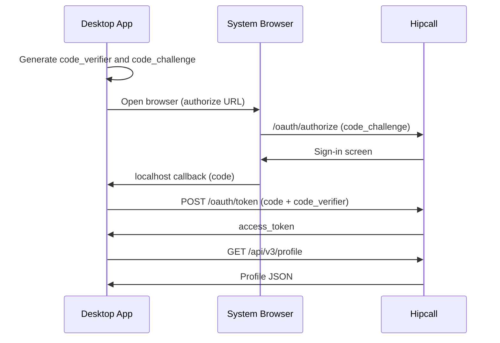

## Overview

Desktop applications run on the user's computer. Application files can be read through reverse engineering, so they cannot store a Client Secret securely. PKCE (Proof Key for Code Exchange) is the standard way to perform token exchange without a Client Secret.

In the PKCE flow, the application generates a random `code_verifier` on every sign-in attempt, sends its SHA-256 hash as the `code_challenge` to the server, and provides the original `code_verifier` as proof during the token exchange. The server compares both to verify that the request comes from the same application.

This page explains how to generate PKCE keys with WPF (.NET), obtain authorisation in the system browser, intercept the callback with a local socket, and fetch profile data.



## Before you start

You need:

- .NET 8 SDK or later.
- A WPF project (`dotnet new wpf -n HipcallDesktop`).

### Obtain your credentials

OAuth2 applications cannot be created directly from the user dashboard. You must provide your application details to the Hipcall support team to obtain your credentials.

Provide the support team with the following:
- **Redirect URI:** `https://yourdomain.ngrok-free.dev/callback` or the ngrok address determined by your organisation.
- **Application Type:** Native / Desktop Application.

Once your request is approved, you will receive a **Client ID**. Because you are using PKCE, you will not receive a Client Secret.

Set the environment variables:

```bash
export HIPCALL_CLIENT_ID="..."
export HIPCALL_REDIRECT_URI="https://yourdomain.ngrok-free.dev/callback"
```

## Step 1: Generate PKCE keys

You must generate a new `code_verifier` for every sign-in attempt. This value is a cryptographically random string between 43 and 128 characters long. The `code_challenge` is the SHA-256 hash of this value, encoded in Base64Url format.

```csharp
using System.Security.Cryptography;
using System.Text;

string GenerateCodeVerifier()
{
    using var rng = RandomNumberGenerator.Create();
    byte[] bytes = new byte[64];
    rng.GetBytes(bytes);
    return Base64UrlEncode(bytes);
}

string GenerateCodeChallenge(string codeVerifier)
{
    using var sha256 = SHA256.Create();
    byte[] hash = sha256.ComputeHash(Encoding.ASCII.GetBytes(codeVerifier));
    return Base64UrlEncode(hash);
}

string Base64UrlEncode(byte[] bytes)
{
    return Convert.ToBase64String(bytes)
        .Replace("+", "-")
        .Replace("/", "_")
        .TrimEnd('=');
}
```

## Step 2: Open the browser and listen for the callback

Open the authorisation URL in the system browser. After the user signs in on Hipcall and grants consent, the browser redirects to the `redirect_uri`. Listen on this address with a local socket to capture the `code` parameter.

Authorisation URL:

```
https://use.hipcall.com/oauth/authorize?response_type=code
  &client_id=$HIPCALL_CLIENT_ID
  &redirect_uri=$HIPCALL_REDIRECT_URI
  &scope=profile+email+offline_access
  &state=desktop_state
  &code_challenge=GENERATED_CODE_CHALLENGE
  &code_challenge_method=S256
```

### Scopes

The `scope` parameter determines what user data your application can access. Separate multiple permissions with a `+` sign (e.g., `profile+email+offline_access`).

You can request the following basic scopes:
- `profile`: Permission to read basic profile details such as name, surname, and ID.
- `email`: Permission to read the user's email address.
- `offline_access`: Permission to obtain a `refresh_token`, allowing you to renew access even when the user is offline.

Use `TcpListener` to capture the callback:

```csharp
using System.Net;
using System.Net.Sockets;

var tcpListener = new TcpListener(IPAddress.Loopback, 5062);
tcpListener.Start();

using var client = await tcpListener.AcceptTcpClientAsync();
using var stream = client.GetStream();

byte[] buffer = new byte[4096];
int bytesRead = await stream.ReadAsync(buffer, 0, buffer.Length);
string requestData = Encoding.UTF8.GetString(buffer, 0, bytesRead);

string firstLine = requestData.Split('\n')[0];
string path = firstLine.Split(' ')[1];

string code = "";
if (path.Contains("?"))
{
    string queryString = path.Substring(path.IndexOf('?') + 1);
    foreach (var param in queryString.Split('&'))
    {
        string[] kv = param.Split('=');
        if (kv.Length == 2 && kv[0] == "code")
            code = kv[1];
    }
}

string htmlBody = "<html><body><h2>Sign-in successful. You can close this tab.</h2></body></html>";
string httpResponse = "HTTP/1.1 200 OK\r\n" +
    "Content-Type: text/html; charset=UTF-8\r\n" +
    "Connection: close\r\n" +
    $"Content-Length: {Encoding.UTF8.GetByteCount(htmlBody)}\r\n\r\n" +
    htmlBody;
await stream.WriteAsync(Encoding.UTF8.GetBytes(httpResponse));

tcpListener.Stop();
```

### Why use TcpListener?

Windows' built-in `HttpListener` class works through the `http.sys` kernel driver. If the `Host` header in the incoming request does not match a registered prefix, it rejects the connection. When a tunnel service like ngrok forwards the request with a different `Host` header, `HttpListener` returns HTTP 400.

`TcpListener` listens to network sockets directly and does not inspect HTTP headers. This allows it to receive requests from ngrok or other tunnel services without issue.

## Step 3: Exchange the code for a token

Perform the token exchange using the captured `code` and the `code_verifier` generated in Step 1. The `client_secret` is not sent in the PKCE flow:

```bash
curl -X POST https://use.hipcall.com/oauth/token \
  -d "client_id=$HIPCALL_CLIENT_ID" \
  -d "grant_type=authorization_code" \
  -d "code=AUTHORISATION_CODE" \
  -d "redirect_uri=$HIPCALL_REDIRECT_URI" \
  -d "code_verifier=GENERATED_CODE_VERIFIER"
```

Extract the `access_token` from the response and fetch the profile data:

```bash
curl -H "Authorization: Bearer $ACCESS_TOKEN" \
  https://use.hipcall.com/api/v3/profile
```

## The full script

The following WPF application demonstrates the entire flow in one file. The XAML side contains a button and a read-only text box:

```xml
<Window x:Class="HipcallDesktop.MainWindow"
        xmlns="http://schemas.microsoft.com/winfx/2006/xaml/presentation"
        xmlns:x="http://schemas.microsoft.com/winfx/2006/xaml"
        Title="Hipcall PKCE OAuth2" Height="600" Width="800">
    <Grid Margin="20">
        <Grid.RowDefinitions>
            <RowDefinition Height="Auto"/>
            <RowDefinition Height="*"/>
        </Grid.RowDefinitions>
        <Button x:Name="LoginButton" Grid.Row="0" Content="Sign in with Hipcall"
                Click="LoginButton_Click" Height="45" Margin="0,0,0,20"/>
        <TextBox x:Name="ResultTextBox" Grid.Row="1" IsReadOnly="True"
                 TextWrapping="Wrap" VerticalScrollBarVisibility="Auto"
                 FontFamily="Consolas" FontSize="14"/>
    </Grid>
</Window>
```

C# code-behind:

```csharp
using System;
using System.Collections.Generic;
using System.Diagnostics;
using System.Net;
using System.Net.Http;
using System.Net.Sockets;
using System.Security.Cryptography;
using System.Text;
using System.Text.Json;
using System.Threading.Tasks;
using System.Windows;

namespace HipcallDesktop
{
    public partial class MainWindow : Window
    {
        private readonly string _clientId;
        private readonly string _redirectUri;
        private readonly HttpClient _httpClient;

        public MainWindow()
        {
            InitializeComponent();
            _httpClient = new HttpClient();
            _clientId = Environment.GetEnvironmentVariable("HIPCALL_CLIENT_ID")
                ?? throw new InvalidOperationException(
                    "HIPCALL_CLIENT_ID is not set.");
            _redirectUri = Environment.GetEnvironmentVariable("HIPCALL_REDIRECT_URI")
                ?? throw new InvalidOperationException(
                    "HIPCALL_REDIRECT_URI is not set.");
        }

        private void LoginButton_Click(object sender, RoutedEventArgs e)
        {
            LoginButton.IsEnabled = false;
            ResultTextBox.Text = "Opening browser, waiting for sign-in...";

            string codeVerifier = GenerateCodeVerifier();
            string codeChallenge = GenerateCodeChallenge(codeVerifier);

            string authorizeUrl =
                "https://use.hipcall.com/oauth/authorize?response_type=code" +
                $"&client_id={_clientId}" +
                $"&redirect_uri={Uri.EscapeDataString(_redirectUri)}" +
                "&scope=profile+email+offline_access" +
                "&state=desktop123" +
                $"&code_challenge={codeChallenge}" +
                "&code_challenge_method=S256";

            ListenForCallback(codeVerifier);

            Process.Start(new ProcessStartInfo
            {
                FileName = authorizeUrl,
                UseShellExecute = true
            });
        }

        private async void ListenForCallback(string codeVerifier)
        {
            try
            {
                int port = new Uri(_redirectUri).Port;
                var tcpListener = new TcpListener(IPAddress.Loopback, port);
                tcpListener.Start();

                using var client = await tcpListener.AcceptTcpClientAsync();
                using var stream = client.GetStream();

                byte[] buffer = new byte[4096];
                int bytesRead = await stream.ReadAsync(buffer, 0, buffer.Length);
                string requestData = Encoding.UTF8.GetString(buffer, 0, bytesRead);

                string firstLine = requestData.Split('\n')[0];
                string[] parts = firstLine.Split(' ');
                string path = parts.Length > 1 ? parts[1] : "";

                string code = "";
                if (path.Contains("?"))
                {
                    string qs = path.Substring(path.IndexOf('?') + 1);
                    foreach (var param in qs.Split('&'))
                    {
                        string[] kv = param.Split('=');
                        if (kv.Length == 2 && kv[0] == "code")
                            code = kv[1];
                    }
                }

                string htmlBody = "<html><body style='font-family:sans-serif;" +
                    "text-align:center;margin-top:50px'>" +
                    "<h2>Sign-in successful. You can close this tab.</h2>" +
                    "</body></html>";
                string httpResp = "HTTP/1.1 200 OK\r\n" +
                    "Content-Type: text/html; charset=UTF-8\r\n" +
                    "Connection: close\r\n" +
                    $"Content-Length: {Encoding.UTF8.GetByteCount(htmlBody)}\r\n\r\n" +
                    htmlBody;
                await stream.WriteAsync(Encoding.UTF8.GetBytes(httpResp));
                tcpListener.Stop();

                if (!string.IsNullOrEmpty(code))
                {
                    Dispatcher.Invoke(() =>
                        ResultTextBox.Text = "Fetching token...");
                    await ExchangeTokenAndFetchProfile(code, codeVerifier);
                }
                else
                {
                    Dispatcher.Invoke(() =>
                    {
                        ResultTextBox.Text = "Authorisation code not found.";
                        LoginButton.IsEnabled = true;
                    });
                }
            }
            catch (Exception ex)
            {
                Dispatcher.Invoke(() =>
                {
                    ResultTextBox.Text = $"Listener error: {ex.Message}";
                    LoginButton.IsEnabled = true;
                });
            }
        }

        private async Task ExchangeTokenAndFetchProfile(
            string code, string codeVerifier)
        {
            try
            {
                var tokenRequest = new FormUrlEncodedContent(
                    new Dictionary<string, string>
                    {
                        { "client_id", _clientId },
                        { "grant_type", "authorization_code" },
                        { "code", code },
                        { "redirect_uri", _redirectUri },
                        { "code_verifier", codeVerifier }
                    });

                var tokenResponse = await _httpClient.PostAsync(
                    "https://use.hipcall.com/oauth/token", tokenRequest);
                var tokenBody = await tokenResponse.Content.ReadAsStringAsync();

                if (!tokenResponse.IsSuccessStatusCode)
                {
                    Console.WriteLine(
                        $"Token error ({tokenResponse.StatusCode}): {tokenBody}");
                    Dispatcher.Invoke(() =>
                    {
                        ResultTextBox.Text = $"Token exchange failed:\n{tokenBody}";
                        LoginButton.IsEnabled = true;
                    });
                    return;
                }

                using var doc = JsonDocument.Parse(tokenBody);
                string accessToken =
                    doc.RootElement.GetProperty("access_token").GetString() ?? "";

                var profileReq = new HttpRequestMessage(HttpMethod.Get,
                    "https://use.hipcall.com/api/v3/profile");
                profileReq.Headers.Authorization =
                    new System.Net.Http.Headers.AuthenticationHeaderValue(
                        "Bearer", accessToken);

                var profileRes = await _httpClient.SendAsync(profileReq);
                var profileBody = await profileRes.Content.ReadAsStringAsync();

                if (!profileRes.IsSuccessStatusCode)
                {
                    Console.WriteLine(
                        $"Profile error ({profileRes.StatusCode}): {profileBody}");
                }

                using var pDoc = JsonDocument.Parse(profileBody);
                string formatted = JsonSerializer.Serialize(pDoc,
                    new JsonSerializerOptions { WriteIndented = true });

                Dispatcher.Invoke(() =>
                {
                    ResultTextBox.Text = formatted;
                    LoginButton.IsEnabled = true;
                });
            }
            catch (Exception ex)
            {
                Dispatcher.Invoke(() =>
                {
                    ResultTextBox.Text = $"Error: {ex.Message}";
                    LoginButton.IsEnabled = true;
                });
            }
        }

        private string GenerateCodeVerifier()
        {
            using var rng = RandomNumberGenerator.Create();
            byte[] bytes = new byte[64];
            rng.GetBytes(bytes);
            return Base64UrlEncode(bytes);
        }

        private string GenerateCodeChallenge(string codeVerifier)
        {
            using var sha256 = SHA256.Create();
            byte[] hash = sha256.ComputeHash(
                Encoding.ASCII.GetBytes(codeVerifier));
            return Base64UrlEncode(hash);
        }

        private string Base64UrlEncode(byte[] bytes)
        {
            return Convert.ToBase64String(bytes)
                .Replace("+", "-")
                .Replace("/", "_")
                .TrimEnd('=');
        }
    }
}
```

## Successful response

A successful token exchange returns:

```json
{
  "access_token": "g2gDbQAAACQ1NjI1...",
  "token_type": "Bearer",
  "expires_in": 7200,
  "refresh_token": "g2gDbQAAACQ3YTlk...",
  "scope": "profile email offline_access",
  "created_at": 1727884800
}
```

The `/api/v3/profile` endpoint returns:

```json
{
  "data": {
    "id": 4200,
    "email": "dev@example.com",
    "name": "Jane D.",
    "time_zone": "Europe/London"
  }
}
```

## When it fails

### HTTP 400 — The request hostname is invalid

If you use a tunnel service like ngrok and choose `HttpListener` to receive the callback, the browser displays this error:

```
Bad Request - Invalid Hostname
HTTP Error 400. The request hostname is invalid.
```

`HttpListener` relies on the Windows `http.sys` kernel driver. If the `Host` header in the incoming request does not match a registered prefix, it drops the connection. Because ngrok forwards the request with `Host: your-tunnel.ngrok-free.dev`, `http.sys` does not recognise it.

Use `TcpListener` to resolve this. `TcpListener` binds directly to TCP sockets and skips HTTP header validation. The code examples on this page use `TcpListener`.

### access_denied

If the user refuses to grant permission to your application on the authorization screen (e.g. by clicking "Cancel"), Hipcall will redirect to your callback URL with an `error=access_denied` parameter. Your application should handle this gracefully and display an appropriate message to the user.

### invalid_grant

If you receive an `invalid_grant` error during the token exchange, the authorisation code was either already used or the `redirect_uri` parameter does not match the registered address exactly. Authorisation codes are single-use.

```json
{
  "error": "invalid_grant",
  "error_description": "The provided authorization grant is invalid, expired, revoked, does not match the redirection URI used in the authorization request, or was issued to another client."
}
```

## Keeping your credentials safe

- PKCE applications do not have a Client Secret. The Client ID is not secret, but you should still read it from an environment variable rather than hardcoding it.
- Do not write access tokens to disk or the registry in plain text. Use Windows Credential Manager or DPAPI.
- Generate a new `code_verifier` for each sign-in attempt. Never reuse the same value.

## Next steps

- Add a token refresh flow using the `refresh_token`.
- Set up token storage integration with Windows Credential Manager.
- Review all available endpoints in the [Hipcall API Reference](https://use.hipcall.com/api-docs/).
- Post your questions on the [Hipcall Community](https://community.hipcall.com/) forum.
