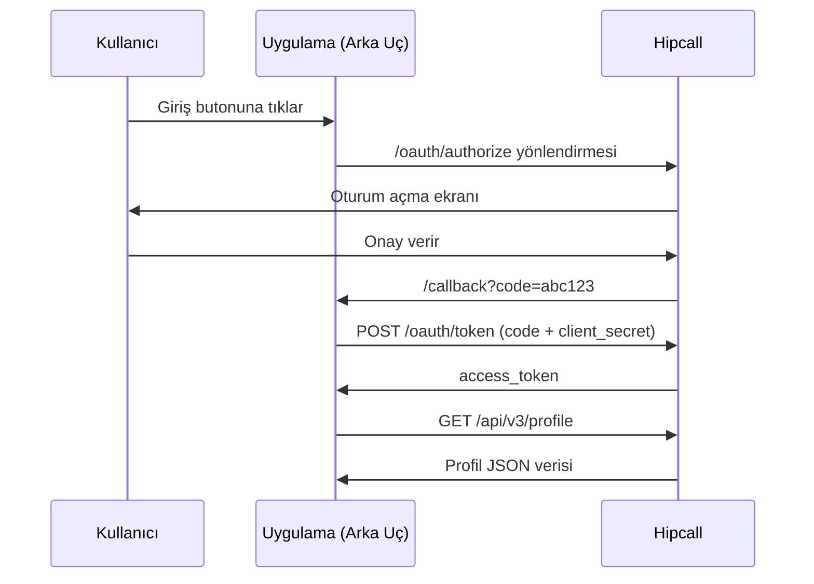

## Genel bakış

OAuth2 Authorization Code akışı, web uygulamanızın Hipcall kullanıcılarının verilerine onların izniyle erişmesini sağlar. Kullanıcı Hipcall'da oturum açar, uygulamanıza bir yetkilendirme kodu döner ve arka ucunuz bu kodu bir erişim belirteci (access token) ile takas eder.

Bu sayfada Hipcall panelinde OAuth2 uygulaması oluşturmayı, ASP.NET Core Minimal API ile token takasını yapmayı ve elde edilen belirteçle profil verisini çekmeyi anlatıyoruz.



## Başlamadan önce

Şunlara ihtiyacınız var:

- .NET 8 SDK veya üstü (`dotnet --version` ile kontrol edin).
- Dışarıdan erişilebilir bir HTTPS adresi. Yerel ortamda ngrok kullanın:
  ```bash
  ngrok http 5062
  ```

### Kimlik bilgilerinizi edinin

OAuth2 uygulamaları doğrudan kullanıcı panelinden oluşturulamaz. Kimlik bilgilerinizi almak için uygulamanızın detaylarını Hipcall destek ekibine iletmeniz gerekir.

Destek ekibine şu bilgileri sağlayın:
- **Yönlendirme Adresi (Redirect URI):** ngrok adresinizi yazın. Örnek: `https://your-tunnel.ngrok-free.dev/callback`.
- **Uygulama Tipi:** Web Uygulaması.

Talebiniz onaylandığında size bir **Client ID** ve **Client Secret** iletilecektir.

Ortam değişkenlerini tanımlayın:

```bash
export HIPCALL_CLIENT_ID="..."
export HIPCALL_CLIENT_SECRET="..."
export HIPCALL_REDIRECT_URI="https://your-tunnel.ngrok-free.dev/callback"
```

## Adım 1: Yetkilendirme URL'sini oluşturun

Kullanıcıyı Hipcall'ın oturum açma ekranına yönlendirmek için aşağıdaki URL yapısını kullanın:

```
https://use.hipcall.com.tr/oauth/authorize?response_type=code
  &client_id=$HIPCALL_CLIENT_ID
  &redirect_uri=$HIPCALL_REDIRECT_URI
  &scope=profile+email+offline_access
  &state=rastgele_bir_deger
```

| Parametre | Açıklama |
|---|---|
| `response_type` | Her zaman `code`. |
| `client_id` | Panelden aldığınız Client ID. |
| `redirect_uri` | Panelde kayıtlı Redirect URI ile birebir aynı olmalı. |
| `scope` | İstenen erişim izinleri. Aşağıdaki listeyi inceleyin. Boşluk yerine `+` ile ayırın. |
| `state` | CSRF koruması. Her isteğe özgü rastgele bir değer üretin ve callback'te doğrulayın. |

### İzin kapsamları (Scopes)

Uygulamanızın kullanıcının hangi verilerine erişebileceğini belirlemek için `scope` parametresini kullanmalısınız. Birden fazla izin istemek için aralarına `+` koyun (örneğin: `profile+email+offline_access`). 

Kullanabileceğiniz temel kapsamlar şunlardır:
- `profile`: Kullanıcının ad, soyad ve ID gibi temel profil bilgilerini okuma izni.
- `email`: Kullanıcının e-posta adresini okuma izni.
- `offline_access`: Yenileme belirteci (`refresh_token`) alarak, kullanıcı çevrimdışı olsa bile erişimi yenileme izni.

## Adım 2: Token takası

Kullanıcı onay verdikten sonra Hipcall, tarayıcıyı `redirect_uri` adresinize `?code=...` parametresiyle yönlendirir. Bu kodu erişim belirteci ile takas etmek için `/oauth/token` adresine POST isteği gönderin:

```bash
curl -X POST https://use.hipcall.com.tr/oauth/token \
  -d "client_id=$HIPCALL_CLIENT_ID" \
  -d "client_secret=$HIPCALL_CLIENT_SECRET" \
  -d "redirect_uri=$HIPCALL_REDIRECT_URI" \
  -d "grant_type=authorization_code" \
  -d "code=YETKILENDIRME_KODU"
```

## Adım 3: Profil verisini çekin

Elde ettiğiniz erişim belirteci ile API'ye istek atın:

```bash
curl -H "Authorization: Bearer $ACCESS_TOKEN" \
  https://use.hipcall.com.tr/api/v3/profile
```

## Betiğin tamamı

Aşağıdaki ASP.NET Core Minimal API uygulaması, callback'i karşılar, token takasını yapar ve profil verisini çeker:

```csharp
using System.Text.Json;

var builder = WebApplication.CreateBuilder(args);
builder.Services.AddHttpClient();
var app = builder.Build();

var clientId = Environment.GetEnvironmentVariable("HIPCALL_CLIENT_ID")
    ?? throw new InvalidOperationException("HIPCALL_CLIENT_ID ortam değişkeni bulunamadı.");
var clientSecret = Environment.GetEnvironmentVariable("HIPCALL_CLIENT_SECRET")
    ?? throw new InvalidOperationException("HIPCALL_CLIENT_SECRET bulunamadı.");
var redirectUri = Environment.GetEnvironmentVariable("HIPCALL_REDIRECT_URI")
    ?? throw new InvalidOperationException("HIPCALL_REDIRECT_URI bulunamadı.");

app.MapGet("/callback", async (string? code, string? error,
    IHttpClientFactory httpClientFactory) =>
{
    if (!string.IsNullOrEmpty(error))
        return Results.Content($"OAuth hatası: {error}", "text/plain");

    if (string.IsNullOrEmpty(code))
        return Results.Content("Yetkilendirme kodu bulunamadı.", "text/plain");

    var httpClient = httpClientFactory.CreateClient();

    var tokenRequest = new FormUrlEncodedContent(new Dictionary<string, string>
    {
        { "client_id", clientId },
        { "client_secret", clientSecret },
        { "redirect_uri", redirectUri },
        { "grant_type", "authorization_code" },
        { "code", code }
    });

    var tokenResponse = await httpClient.PostAsync(
        "https://use.hipcall.com.tr/oauth/token", tokenRequest);
    var tokenBody = await tokenResponse.Content.ReadAsStringAsync();

    if (!tokenResponse.IsSuccessStatusCode)
    {
        Console.WriteLine($"Token hatası ({tokenResponse.StatusCode}): {tokenBody}");
        return Results.Content($"Token alınamadı: {tokenBody}", "text/plain");
    }

    using var tokenDoc = JsonDocument.Parse(tokenBody);
    var accessToken = tokenDoc.RootElement.GetProperty("access_token").GetString();

    var profileReq = new HttpRequestMessage(HttpMethod.Get,
        "https://use.hipcall.com.tr/api/v3/profile");
    profileReq.Headers.Authorization =
        new System.Net.Http.Headers.AuthenticationHeaderValue("Bearer", accessToken);

    var profileResponse = await httpClient.SendAsync(profileReq);
    var profileBody = await profileResponse.Content.ReadAsStringAsync();

    if (!profileResponse.IsSuccessStatusCode)
    {
        Console.WriteLine($"Profil hatası ({profileResponse.StatusCode}): {profileBody}");
        return Results.Content($"Profil alınamadı: {profileBody}", "text/plain");
    }

    return Results.Content(profileBody, "application/json");
});

app.Run();
```

## Başarılı cevap

Token takası başarılı olduğunda `/oauth/token` şu yapıda bir JSON döner:

```json
{
  "access_token": "g2gDbQAAACQ1NjI1...",
  "token_type": "Bearer",
  "expires_in": 7200,
  "refresh_token": "g2gDbQAAACQ3YTlk...",
  "scope": "profile email offline_access",
  "created_at": 1727884800
}
```

`/api/v3/profile` endpoint'inin cevabı:

```json
{
  "data": {
    "id": 4200,
    "email": "dev@example.com",
    "name": "Mehmet Y.",
    "time_zone": "Europe/Istanbul"
  }
}
```

## Hata aldığınızda

### invalid_grant

Token takası sırasında aşağıdaki cevabı alırsanız:

```json
{
  "error": "invalid_grant",
  "error_description": "The provided authorization grant is invalid, expired, revoked, does not match the redirection URI used in the authorization request, or was issued to another client."
}
```

İki olası neden vardır:

**Kod zaten kullanıldı.** OAuth2 yetkilendirme kodları tek kullanımlıktır. Tarayıcıda sayfa yenilendiğinde aynı `code` parametresi sunucuya tekrar gönderilir ve sunucu kodu reddeder. Sayfa yüklendikten sonra URL'deki `code` parametresini temizleyin:

```html
<script>
    if (window.history.replaceState) {
        window.history.replaceState({}, document.title, "/");
    }
</script>
```

Bu kod, tarayıcı geçmişini bozmadan adres çubuğunu kök dizine (`/`) döndürür. Sayfa yenilendiğinde sunucuya kod gitmez.

**Redirect URI uyuşmazlığı.** Token isteğindeki `redirect_uri`, panelde kayıtlı adresle birebir eşleşmelidir. Sondaki eğik çizgi (`/`) farkı bile uyuşmazlık sayılır.

### CORS hatası

Tarayıcınızın adres çubuğuna API URL'sini yazıp girdiğinizde sayfa sorunsuz açılır. Ancak aynı adrese kendi web sayfanızın içinden JavaScript (`fetch` veya `AJAX`) ile arka planda istek atmaya kalktığınızda tarayıcı güvenliği devreye girer. Tarayıcı, sizin siteniz (`localhost` veya `seninsiten.com`) ile Hipcall'un farklı alan adları olduğunu tespit eder. Hipcall sunucuları güvenlik gereği dış sitelerden gelen bu tür doğrudan JavaScript isteklerini reddettiği için, tarayıcınız işlemi bloke edip `blocked by CORS policy` hatası fırlatır.

Bu kısıtlama tarayıcılara (Chrome, Safari vb.) özeldir. C# (ASP.NET Core) gibi arka uç (backend) sunucularında tarayıcı ortamı bulunmadığı için CORS kısıtlaması da yoktur. Token takasını ve veri çekme işlemlerini hiçbir zaman önyüzdeki JavaScript ile yapmayın. İstekleri her zaman C# sunucunuz üzerinden Hipcall'a iletin ve dönen güvenli veriyi kendi önyüzünüze aktarın.

### 401 Unauthorized

Erişim belirtecinin süresi dolmuşsa API, HTTP 401 döner:

```json
{
  "error": "unauthorized",
  "error_description": "The access token is invalid or has expired."
}
```

`refresh_token` kullanarak yeni bir erişim belirteci alın. Yenileme belirteci almak için ilk yetkilendirme isteğinde `offline_access` scope'unu eklemeniz gerekir.

## Kimlik bilgilerinizi güvende tutun

- Client Secret panelde yalnızca bir kez gösterilir. Kaybederseniz mevcut anahtarı silip yenisini oluşturun.
- Client Secret'ı kaynak koduna yazmayın. Ortam değişkeni veya güvenli bir yapılandırma yöneticisi (Azure Key Vault, AWS Secrets Manager) kullanın.
- Client Secret sızdıysa panelden derhal silin ve yeni bir uygulama oluşturun. Eski belirteçler geçersiz olur.
- Erişim belirteçlerini istemci tarafında (localStorage, cookie) saklamayın. Token'ı sunucu oturumunda tutun.

## Sonraki adımlar

- `refresh_token` ile belirteç yenileme akışını ekleyin.
- [Hipcall API Referansı](https://use.hipcall.com.tr/api-docs/) sayfasından tüm endpoint'leri inceleyin.
- Sorularınızı [Hipcall Topluluk](https://community.hipcall.com/) platformunda paylaşın.
