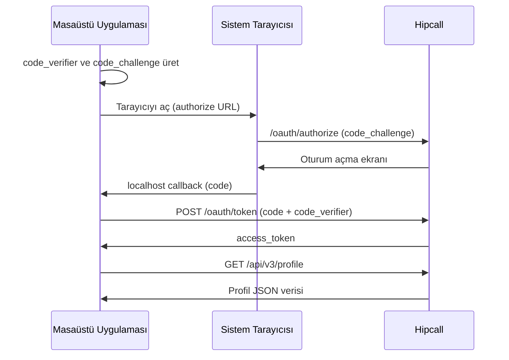

## Genel bakış

Masaüstü uygulamaları kullanıcının bilgisayarında çalışır. Uygulama dosyaları tersine mühendislikle okunabilir, bu yüzden Client Secret güvenle saklanamaz. PKCE (Proof Key for Code Exchange), Client Secret olmadan token takası yapmanın standart yoludur.

PKCE akışında uygulama her giriş denemesinde rastgele bir `code_verifier` üretir, bunun SHA-256 özetini `code_challenge` olarak sunucuya gönderir ve token takasında orijinal `code_verifier` değerini kanıt olarak sunar. Sunucu ikisini karşılaştırarak isteğin aynı uygulamadan geldiğini doğrular.

Bu sayfada WPF (.NET) ile PKCE anahtarlarını üretmeyi, sistem tarayıcısında yetki almayı ve geri dönüşü yerel bir soketle yakalayarak profil verisini çekmeyi anlatıyoruz.



## Başlamadan önce

Şunlara ihtiyacınız var:

- .NET 8 SDK veya üstü.
- WPF projesi (`dotnet new wpf -n HipcallDesktop`).

### Kimlik bilgilerinizi edinin

OAuth2 uygulamaları doğrudan kullanıcı panelinden oluşturulamaz. Kimlik bilgilerinizi almak için uygulamanızın detaylarını Hipcall destek ekibine iletmeniz gerekir.

Destek ekibine şu bilgileri sağlayın:
- **Yönlendirme Adresi (Redirect URI):** `http://localhost:5000/callback` veya kuruluşunuzun belirlediği adres.
- **Uygulama Tipi:** Masaüstü Uygulaması (Native).

Talebiniz onaylandığında size bir **Client ID** iletilecektir. PKCE kullandığınız için Client Secret verilmeyecektir.

Ortam değişkenlerini tanımlayın:

```bash
export HIPCALL_CLIENT_ID="..."
export HIPCALL_REDIRECT_URI="http://localhost:5000/callback"
```

## Adım 1: PKCE anahtarlarını üretin

Her giriş denemesinde yeni bir `code_verifier` üretilmelidir. Bu değer 43 ile 128 karakter arasında, kriptografik olarak rastgele bir dizedir. `code_challenge` ise bu değerin SHA-256 özeti olup Base64Url formatında kodlanır.

```csharp
using System.Security.Cryptography;
using System.Text;

string GenerateCodeVerifier()
{
    using var rng = RandomNumberGenerator.Create();
    byte[] bytes = new byte[64];
    rng.GetBytes(bytes);
    return Base64UrlEncode(bytes);
}

string GenerateCodeChallenge(string codeVerifier)
{
    using var sha256 = SHA256.Create();
    byte[] hash = sha256.ComputeHash(Encoding.ASCII.GetBytes(codeVerifier));
    return Base64UrlEncode(hash);
}

string Base64UrlEncode(byte[] bytes)
{
    return Convert.ToBase64String(bytes)
        .Replace("+", "-")
        .Replace("/", "_")
        .TrimEnd('=');
}
```

## Adım 2: Tarayıcıyı açın ve geri dönüşü dinleyin

Yetkilendirme URL'sini sistem tarayıcısında açın. Kullanıcı Hipcall'da oturum açıp onay verdikten sonra tarayıcı `redirect_uri` adresine yönlendirilir. Bu adresi yerel bir soketle dinleyerek `code` parametresini yakalayın.

Yetkilendirme URL'si:

```
https://use.hipcall.com.tr/oauth/authorize?response_type=code
  &client_id=$HIPCALL_CLIENT_ID
  &redirect_uri=$HIPCALL_REDIRECT_URI
  &scope=profile+email+offline_access
  &state=desktop_state
  &code_challenge=URETILEN_CODE_CHALLENGE
  &code_challenge_method=S256
```

### İzin kapsamları (Scopes)

Yetkilendirme URL'sindeki `scope` parametresi ile uygulamanızın hangi verilere erişebileceğini belirlersiniz. Birden fazla izin istemek için aralarına artı işareti (`+`) koyun (örneğin: `profile+email+offline_access`). 

Kullanabileceğiniz temel kapsamlar şunlardır:
- `profile`: Kullanıcının ad, soyad ve ID gibi temel profil bilgilerini okuma izni.
- `email`: Kullanıcının e-posta adresini okuma izni.
- `offline_access`: Yenileme belirteci (`refresh_token`) alarak, kullanıcı çevrimdışı olsa bile erişimi yenileme izni.

Geri dönüşü dinlemek için `TcpListener` kullanın:

```csharp
using System.Net;
using System.Net.Sockets;

var tcpListener = new TcpListener(IPAddress.Loopback, 5000);
tcpListener.Start();

using var client = await tcpListener.AcceptTcpClientAsync();
using var stream = client.GetStream();

byte[] buffer = new byte[4096];
int bytesRead = await stream.ReadAsync(buffer, 0, buffer.Length);
string requestData = Encoding.UTF8.GetString(buffer, 0, bytesRead);

string firstLine = requestData.Split('\n')[0];
string path = firstLine.Split(' ')[1];

string code = "";
if (path.Contains("?"))
{
    string queryString = path.Substring(path.IndexOf('?') + 1);
    foreach (var param in queryString.Split('&'))
    {
        string[] kv = param.Split('=');
        if (kv.Length == 2 && kv[0] == "code")
            code = kv[1];
    }
}

string htmlBody = "<html><body><h2>Giris basarili. Bu sekmeyi kapatabilirsiniz.</h2></body></html>";
string httpResponse = "HTTP/1.1 200 OK\r\n" +
    "Content-Type: text/html; charset=UTF-8\r\n" +
    "Connection: close\r\n" +
    $"Content-Length: {Encoding.UTF8.GetByteCount(htmlBody)}\r\n\r\n" +
    htmlBody;
await stream.WriteAsync(Encoding.UTF8.GetBytes(httpResponse));

tcpListener.Stop();
```

### Neden TcpListener?

Windows'un yerleşik `HttpListener` sınıfı `http.sys` çekirdek sürücüsü üzerinden çalışır. Gelen istekteki `Host` başlığı, kayıtlı bir ön ek (prefix) ile eşleşmezse bağlantıyı reddeder. ngrok gibi tünel servisleri isteği farklı bir `Host` başlığıyla ilettiğinde `HttpListener` HTTP 400 döner.

`TcpListener` ağ soketlerini doğrudan dinler ve `Host` başlığını denetlemez. Bu sayede ngrok veya başka bir tünel servisinden gelen istekleri sorunsuz karşılar.

## Adım 3: Token takası

Yakaladığınız `code` ve Adım 1'de ürettiğiniz `code_verifier` ile token takasını yapın. PKCE akışında `client_secret` gönderilmez:

```bash
curl -X POST https://use.hipcall.com.tr/oauth/token \
  -d "client_id=$HIPCALL_CLIENT_ID" \
  -d "grant_type=authorization_code" \
  -d "code=YETKILENDIRME_KODU" \
  -d "redirect_uri=$HIPCALL_REDIRECT_URI" \
  -d "code_verifier=URETILEN_CODE_VERIFIER"
```

Token cevabından `access_token` değerini alın ve profil verisini çekin:

```bash
curl -H "Authorization: Bearer $ACCESS_TOKEN" \
  https://use.hipcall.com.tr/api/v3/profile
```

## Betiğin tamamı

Aşağıdaki WPF uygulaması tüm akışı tek dosyada gösterir. XAML tarafında bir buton ve salt okunur bir metin kutusu bulunur:

```xml
<Window x:Class="HipcallDesktop.MainWindow"
        xmlns="http://schemas.microsoft.com/winfx/2006/xaml/presentation"
        xmlns:x="http://schemas.microsoft.com/winfx/2006/xaml"
        Title="Hipcall PKCE OAuth2" Height="600" Width="800">
    <Grid Margin="20">
        <Grid.RowDefinitions>
            <RowDefinition Height="Auto"/>
            <RowDefinition Height="*"/>
        </Grid.RowDefinitions>
        <Button x:Name="LoginButton" Grid.Row="0" Content="Hipcall ile Giris Yap"
                Click="LoginButton_Click" Height="45" Margin="0,0,0,20"/>
        <TextBox x:Name="ResultTextBox" Grid.Row="1" IsReadOnly="True"
                 TextWrapping="Wrap" VerticalScrollBarVisibility="Auto"
                 FontFamily="Consolas" FontSize="14"/>
    </Grid>
</Window>
```

C# arka plan kodu:

```csharp
using System;
using System.Collections.Generic;
using System.Diagnostics;
using System.Net;
using System.Net.Http;
using System.Net.Sockets;
using System.Security.Cryptography;
using System.Text;
using System.Text.Json;
using System.Threading.Tasks;
using System.Windows;

namespace HipcallDesktop
{
    public partial class MainWindow : Window
    {
        private readonly string _clientId;
        private readonly string _redirectUri;
        private readonly HttpClient _httpClient;

        public MainWindow()
        {
            InitializeComponent();
            _httpClient = new HttpClient();
            _clientId = Environment.GetEnvironmentVariable("HIPCALL_CLIENT_ID")
                ?? throw new InvalidOperationException(
                    "HIPCALL_CLIENT_ID ortam degiskeni bulunamadi.");
            _redirectUri = Environment.GetEnvironmentVariable("HIPCALL_REDIRECT_URI")
                ?? throw new InvalidOperationException(
                    "HIPCALL_REDIRECT_URI ortam degiskeni bulunamadi.");
        }

        private void LoginButton_Click(object sender, RoutedEventArgs e)
        {
            LoginButton.IsEnabled = false;
            ResultTextBox.Text = "Tarayici aciliyor, giris yapmaniz bekleniyor...";

            string codeVerifier = GenerateCodeVerifier();
            string codeChallenge = GenerateCodeChallenge(codeVerifier);

            string authorizeUrl =
                "https://use.hipcall.com.tr/oauth/authorize?response_type=code" +
                $"&client_id={_clientId}" +
                $"&redirect_uri={Uri.EscapeDataString(_redirectUri)}" +
                "&scope=profile+email+offline_access" +
                "&state=desktop123" +
                $"&code_challenge={codeChallenge}" +
                "&code_challenge_method=S256";

            ListenForCallback(codeVerifier);

            Process.Start(new ProcessStartInfo
            {
                FileName = authorizeUrl,
                UseShellExecute = true
            });
        }

        private async void ListenForCallback(string codeVerifier)
        {
            try
            {
                int port = new Uri(_redirectUri).Port;
                var tcpListener = new TcpListener(IPAddress.Loopback, port);
                tcpListener.Start();

                using var client = await tcpListener.AcceptTcpClientAsync();
                using var stream = client.GetStream();

                byte[] buffer = new byte[4096];
                int bytesRead = await stream.ReadAsync(buffer, 0, buffer.Length);
                string requestData = Encoding.UTF8.GetString(buffer, 0, bytesRead);

                string firstLine = requestData.Split('\n')[0];
                string[] parts = firstLine.Split(' ');
                string path = parts.Length > 1 ? parts[1] : "";

                string code = "";
                if (path.Contains("?"))
                {
                    string qs = path.Substring(path.IndexOf('?') + 1);
                    foreach (var param in qs.Split('&'))
                    {
                        string[] kv = param.Split('=');
                        if (kv.Length == 2 && kv[0] == "code")
                            code = kv[1];
                    }
                }

                string htmlBody = "<html><body style='font-family:sans-serif;" +
                    "text-align:center;margin-top:50px'>" +
                    "<h2>Giris basarili. Bu sekmeyi kapatabilirsiniz.</h2>" +
                    "</body></html>";
                string httpResp = "HTTP/1.1 200 OK\r\n" +
                    "Content-Type: text/html; charset=UTF-8\r\n" +
                    "Connection: close\r\n" +
                    $"Content-Length: {Encoding.UTF8.GetByteCount(htmlBody)}\r\n\r\n" +
                    htmlBody;
                await stream.WriteAsync(Encoding.UTF8.GetBytes(httpResp));
                tcpListener.Stop();

                if (!string.IsNullOrEmpty(code))
                {
                    Dispatcher.Invoke(() =>
                        ResultTextBox.Text = "Token alinıyor...");
                    await ExchangeTokenAndFetchProfile(code, codeVerifier);
                }
                else
                {
                    Dispatcher.Invoke(() =>
                    {
                        ResultTextBox.Text = "Yetkilendirme kodu alinamadi.";
                        LoginButton.IsEnabled = true;
                    });
                }
            }
            catch (Exception ex)
            {
                Dispatcher.Invoke(() =>
                {
                    ResultTextBox.Text = $"Dinleyici hatasi: {ex.Message}";
                    LoginButton.IsEnabled = true;
                });
            }
        }

        private async Task ExchangeTokenAndFetchProfile(
            string code, string codeVerifier)
        {
            try
            {
                var tokenRequest = new FormUrlEncodedContent(
                    new Dictionary<string, string>
                    {
                        { "client_id", _clientId },
                        { "grant_type", "authorization_code" },
                        { "code", code },
                        { "redirect_uri", _redirectUri },
                        { "code_verifier", codeVerifier }
                    });

                var tokenResponse = await _httpClient.PostAsync(
                    "https://use.hipcall.com.tr/oauth/token", tokenRequest);
                var tokenBody = await tokenResponse.Content.ReadAsStringAsync();

                if (!tokenResponse.IsSuccessStatusCode)
                {
                    Console.WriteLine(
                        $"Token hatasi ({tokenResponse.StatusCode}): {tokenBody}");
                    Dispatcher.Invoke(() =>
                    {
                        ResultTextBox.Text = $"Token alinamadi:\n{tokenBody}";
                        LoginButton.IsEnabled = true;
                    });
                    return;
                }

                using var doc = JsonDocument.Parse(tokenBody);
                string accessToken =
                    doc.RootElement.GetProperty("access_token").GetString() ?? "";

                var profileReq = new HttpRequestMessage(HttpMethod.Get,
                    "https://use.hipcall.com.tr/api/v3/profile");
                profileReq.Headers.Authorization =
                    new System.Net.Http.Headers.AuthenticationHeaderValue(
                        "Bearer", accessToken);

                var profileRes = await _httpClient.SendAsync(profileReq);
                var profileBody = await profileRes.Content.ReadAsStringAsync();

                if (!profileRes.IsSuccessStatusCode)
                {
                    Console.WriteLine(
                        $"Profil hatasi ({profileRes.StatusCode}): {profileBody}");
                }

                using var pDoc = JsonDocument.Parse(profileBody);
                string formatted = JsonSerializer.Serialize(pDoc,
                    new JsonSerializerOptions { WriteIndented = true });

                Dispatcher.Invoke(() =>
                {
                    ResultTextBox.Text = formatted;
                    LoginButton.IsEnabled = true;
                });
            }
            catch (Exception ex)
            {
                Dispatcher.Invoke(() =>
                {
                    ResultTextBox.Text = $"Hata: {ex.Message}";
                    LoginButton.IsEnabled = true;
                });
            }
        }

        private string GenerateCodeVerifier()
        {
            using var rng = RandomNumberGenerator.Create();
            byte[] bytes = new byte[64];
            rng.GetBytes(bytes);
            return Base64UrlEncode(bytes);
        }

        private string GenerateCodeChallenge(string codeVerifier)
        {
            using var sha256 = SHA256.Create();
            byte[] hash = sha256.ComputeHash(
                Encoding.ASCII.GetBytes(codeVerifier));
            return Base64UrlEncode(hash);
        }

        private string Base64UrlEncode(byte[] bytes)
        {
            return Convert.ToBase64String(bytes)
                .Replace("+", "-")
                .Replace("/", "_")
                .TrimEnd('=');
        }
    }
}
```

## Başarılı cevap

PKCE ile token takası başarılı olduğunda `/oauth/token` şu yapıda bir JSON döner:

```json
{
  "access_token": "g2gDbQAAACQ1NjI1...",
  "token_type": "Bearer",
  "expires_in": 7200,
  "refresh_token": "g2gDbQAAACQ3YTlk...",
  "scope": "profile email offline_access",
  "created_at": 1727884800
}
```

`/api/v3/profile` endpoint'inin cevabı:

```json
{
  "data": {
    "id": 4200,
    "email": "dev@example.com",
    "name": "Mehmet Y.",
    "time_zone": "Europe/Istanbul"
  }
}
```

## Hata aldığınızda

### HTTP 400 — The request hostname is invalid

ngrok veya benzeri bir tünel servisi kullanıyorsanız ve callback dinlemek için `HttpListener` tercih ettiyseniz, tarayıcıda şu hatayla karşılaşırsınız:

```
Bad Request - Invalid Hostname
HTTP Error 400. The request hostname is invalid.
```

`HttpListener`, Windows `http.sys` çekirdek sürücüsü üzerinden çalışır. Gelen istekteki `Host` başlığı kayıtlı ön ekle eşleşmezse isteği reddeder. ngrok gelen isteği `Host: your-tunnel.ngrok-free.dev` başlığıyla ilettiği için `http.sys` bunu tanımaz.

Çözüm olarak `TcpListener` kullanın. `TcpListener` TCP soketlerini doğrudan dinler ve HTTP başlıklarını denetlemez. Bu sayfadaki kod örnekleri `TcpListener` kullanır.

### access_denied

Kullanıcı yetkilendirme ekranında uygulamanıza izin vermeyi reddederse (örneğin "İptal" butonuna basarsa) Hipcall, callback adresinize `error=access_denied` parametresiyle döner. Uygulamanızda bu durumu yakalayıp kullanıcıya uygun bir mesaj göstermelisiniz.

### invalid_grant

Token takası sırasında `invalid_grant` hatası alırsanız nedeni iki şeyden biridir: yetkilendirme kodu zaten kullanılmıştır (kodlar tek kullanımlıktır) veya `redirect_uri` parametresi panelde kayıtlı adresle birebir eşleşmiyordur.

```json
{
  "error": "invalid_grant",
  "error_description": "The provided authorization grant is invalid, expired, revoked, does not match the redirection URI used in the authorization request, or was issued to another client."
}
```

## Kimlik bilgilerinizi güvende tutun

- PKCE uygulamalarında Client Secret yoktur. Client ID gizli değildir, ancak yine de kaynak koduna yazmak yerine ortam değişkeninden okuyun.
- Erişim belirteçlerini diske veya kayıt defterine (registry) düz metin olarak yazmayın. Windows Credential Manager veya DPAPI kullanın.
- `code_verifier` değerini her oturum açma denemesinde yeniden üretin. Aynı değeri tekrar kullanmayın.

## Sonraki adımlar

- `refresh_token` ile belirteç yenileme akışını ekleyin.
- Windows Credential Manager ile belirteç saklama entegrasyonu kurun.
- [Hipcall API Referansı](https://use.hipcall.com.tr/api-docs/) sayfasından tüm endpoint'leri inceleyin.
- Sorularınızı [Hipcall Topluluk](https://community.hipcall.com/) platformunda paylaşın.
